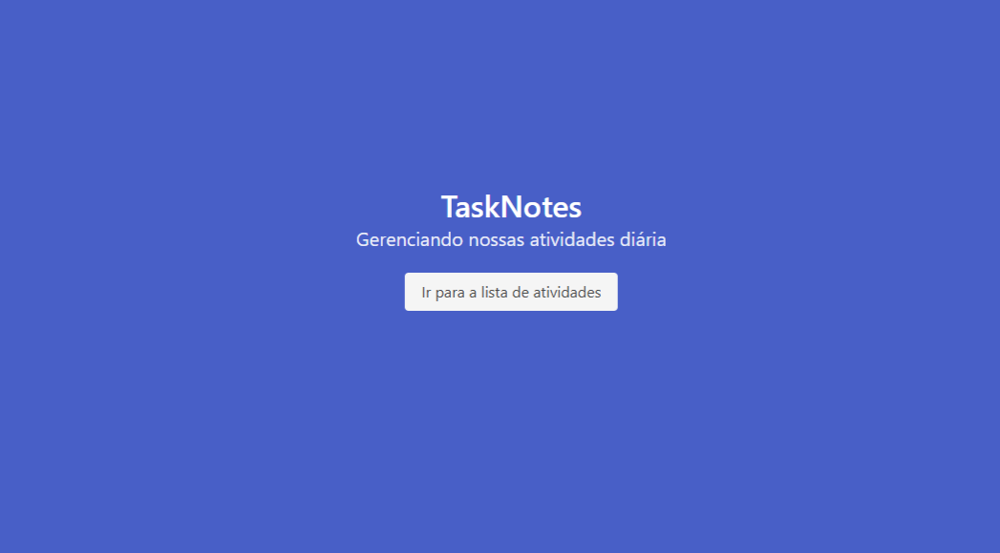
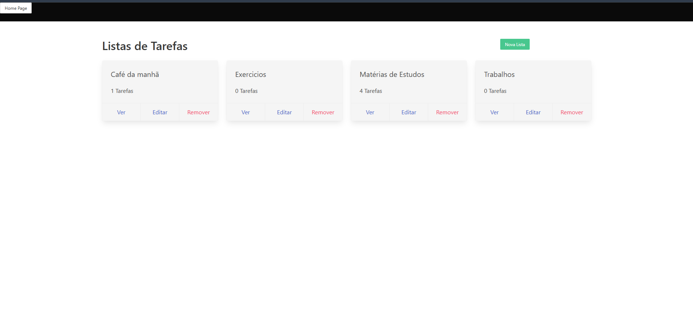

![Logo]  <h3>Task Notes</h3>

Aplicação desenvolvida para criação de notas, assim podendo criar uma rotina de atividades e lembretes para o seu Dia-a-Dia.

O desenvolvimento deste aplicativo faz parte do exercicio da escola de javaScript OneBitCode.

Aplicação Desenvolvida com base nos conchecimentos adquiridos em React e NodeJs.

<h3>Instale as seguintes dependências antes de rodar o projeto:</h3>

-npm install ejs 

-npm install express

-npm install method-override

-npm install mongoose

