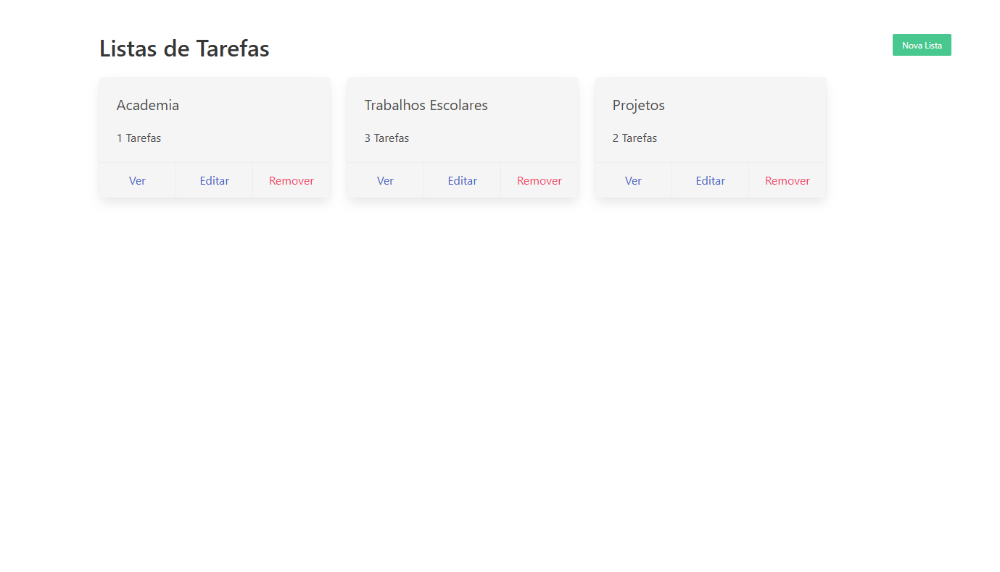

#  Task Notes

Aplicação desenvolvida para criação de notas, assim podendo criar uma rotina de atividades e lembretes para o seu Dia-a-Dia.

O desenvolvimento deste aplicativo faz parte do exercicio da escola de javaScript OneBitCode.

Aplicação Desenvolvida com base nos conhecimentos adquiridos em React e NodeJs.

<h3>Instale as seguintes dependências antes de rodar o projeto:</h3>

-npm install ejs 

-npm install express

-npm install method-override

-npm install mongoose

 

Tela Inicial:

 

Tela Principal:

Entrando nessa tela é possivel criar diversas notas para melhorar e organizar as atividades do seu cotidiano.

 

Ao criar uma nota é possivel acessá-la e criar diversas Tarefas, como também é possivel removelas.

